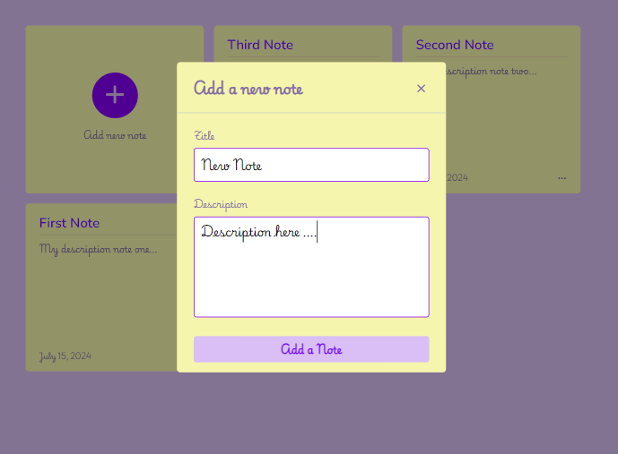

<h1 align="center"> Note APP || Project in JS </h1>

Este projeto é um aplicativo de notas construído utilizando HTML, CSS e JavaScript. O aplicativo permite que os usuários adicionem, editem e excluam suas notas de forma simples e intuitiva.

# Funcionalidades
- Adicionar Notas: Permite que os usuários criem novas notas.
- Editar Notas: Permite que os usuários modifiquem notas existentes.
- Excluir Notas: Permite que os usuários removam notas indesejadas.

# Persistência de Dados
As notas adicionadas pelos usuários são armazenadas no armazenamento local do navegador (localStorage). Isso garante que as notas não sejam perdidas ao atualizar a página ou fechar a aba do navegador.  

  <a href="#-tecnologias">Tecnologias</a>&nbsp;&nbsp;&nbsp;|&nbsp;&nbsp;&nbsp;
  <a href="#-projeto">Projeto</a>&nbsp;&nbsp;&nbsp;|&nbsp;&nbsp;&nbsp;
  <a href="#memo-licença">Licença</a>

  

  

 

## 🚀 Tecnologias

- Esse projeto foi desenvolvido com as seguintes tecnologias:

- HTML e CSS
- JavaScript
- Git e Github

## 💻 Projeto

- O CSS Grid oferece controle sobre as linhas e colunas do design do app.

- O JavaScript fica responsável pela interação do usuário com o aplicativo. Ele permite que os usuários adicionem, editem e excluam suas notas, além de garantir que essas notas sejam salvas no localStorage do navegador para que não sejam perdidas ao atualizar a página ou fechar a aba.

- [Visite o projeto online]()!
